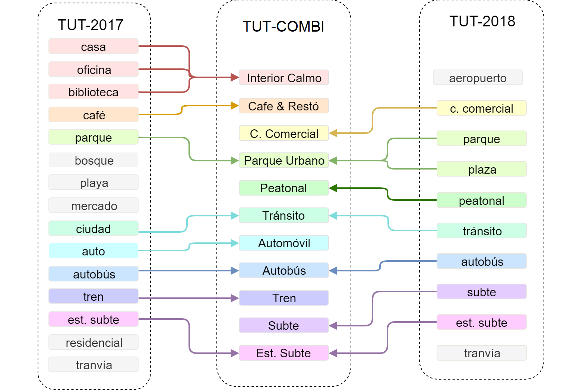
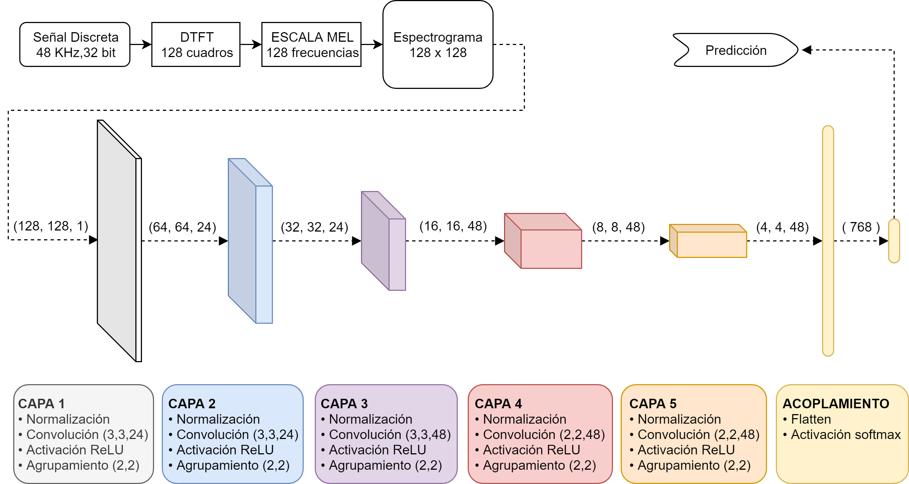
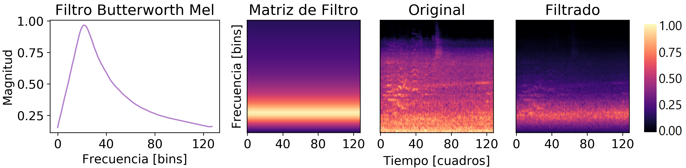
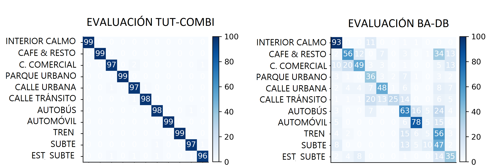
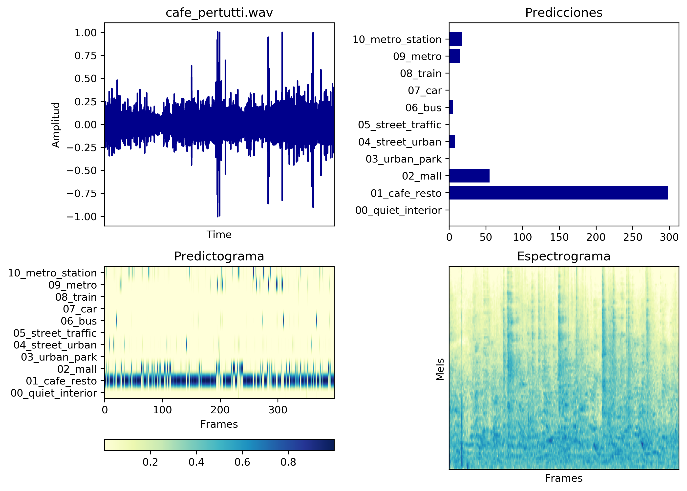

# Clasificador de Escenas Sonoras
Luciano De Bortoli  
Universidad Nacional de Tres de Febrero  

## Base de datos:
* TUT 2017
* TUT 2018

Tras una inspección manual, se aplican preprocesos a los audios de las bases de datos que consisten en filtrado y limpieza de muestras.
Se seleccionan y combinan algunas de las clases de las bases de datos para formar una nueva base de datos "COMBI".

## Descriptores
A partir de cada audio se extrae un espectrograma en escala Mel, con 128 componentes de frecuencia.  
Cada espectrograma tiene 128 componentes temporales que representan 2.7 segundos de audio.  
El espectrograma se obtiene calculando una FFT cada 1024 muestras de audio,
utilizando ventanas hanning de 2048 muestras de tamaño.  

Magnitudes de espectrograma en escala mel promedio por clase 

## Modelo:
Para el modelo clasificador se utiliza una arquitectura de tipo CNN.

## Aumento de Datos
Para el entrenamiento del modelo se interviene cada lote para aplicar procesos de aumento de datos sobre los espectrogramas.
Los procesos consisten en aplicar un filtro aleatorio de tipologia Butterworth, los cuales mostraron mejoras en el rendimiento.

## Entrenamiento
El modelo se entrena por 40 épocas, eligiendo la versión con mejor rendimiento con datos de validación.

## Evaluación
El modelo se evalúa utilizando la bases de datos de evaluación BADB, la cual consiste en registros de audio de 
diferentes lugares de Buenos Aires, utilizando un único dispositivo móvil (Motorola G4).

Los resultados obtenidos con este set de evaluación BADB se distinguen de los obtenidos con la partición de evaluación de COMBI,
mostrando que el modelo no logra generalizar todas las clases de escenas sonoras, aunque se rescata el rendimiento para la clasificación de interiores de hogar, automóviles y autobuses. 

## Discusión
Se piensa que la limitación más importante son las bases de datos de entrenamiento, las cuales presentan alta parcialidad a las 
escenas sonoras registradas en ciudades europeas y con una limitada variedad de dispositivos móviles.

## DEMO
Para realizar una predicción sobre una señal de audio utilizando el clasificador, correr predict.py con una consola.
Como argumento señalar la ruta al archivo de audio (.wav).
Como salida, se genera una imagen mostrando las predicciones del modelo para cada segmento de 2.7 segundos de duración.
El modelo que realiza la inferencia es CNN.tflite, que es el mismo archivo que realiza la inferencia en la app de Android.

